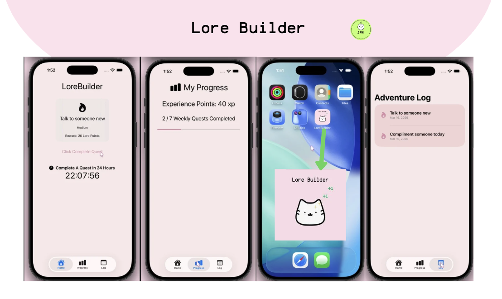

# LoreBuilder

## Life Sometimes Feels A Little Boring?

Many productivity tools focus on task lists, reminders, and deadlines, but they often feel repetitive and uninspiring. Over time, this can make personal growth goals feel more like obligations rather than meaningful achievements.

People frequently struggle with:

* Staying motivated to complete small daily goals
* Tracking personal progress in a rewarding way
* Turning everyday habits into something engaging and meaningful

Without a sense of progress or reward, it becomes easy to lose motivation and abandon goals entirely.

### Screenshot

---

## Make Personal Development Fun Again!

LoreBuilder transforms personal development into a gamified experience by framing everyday tasks as quests in a personal adventure.

Instead of simply checking off tasks, users complete quests, earn Lore Points, and build an Adventure Log that represents their progress over time.

By combining gamification with productivity, LoreBuilder helps users stay engaged, motivated, and consistent with their personal growth.

---

## Features

Random daily quest generator

Quest difficulty levels with different rewards

Experience point (Lore Points) system

Adventure Log of completed quests

Daily countdown timer for quest reset

Weekly progress tracking

## Technologies

Swift

SwiftUI

Combine

MVVM Architecture
